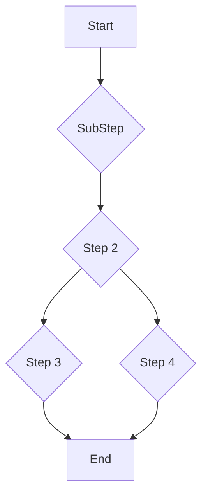

# StepCeption

Simple Terraform project creating a step function that calls a seperate step function.

I use a data lookup to recreate the lambda_function.zip file so any code change will be picked up when deployed

## Rough Topology

### Step Function Flow

### Steps

1. Invoke Step function
2. Step Function invokes second step function

## Prerequisites
Before you begin, make sure you have the following prerequisites:

* [Terraform](https://developer.hashicorp.com/terraform/tutorials/aws-get-started/install-cli) installed on your local machine.
* An AWS account.
* AWS access key and secret key with sufficient permissions to create resources.

## Infrastructure Setup

* Clone the repository to your local machine.
* Navigate to the project directory.
* Create a `terraform.tfvars` adding your AWS_ACCESS_KEY, AWS_SECRET_KEY, and REGION.
* Run `terraform init` to download the necessary provider plugins.
* Run `terraform plan` to preview the changes that Terraform will make to your infrastructure.
* Run `terraform apply` to create the infrastructure on AWS.
* When you are finished using the infrastructure, run `terraform destroy` to delete all the resources that Terraform created.

## Running Step Function

### Through AWS Console

* Navigate to **Step Functions** 
* Select **State Machines**
* click on **step1_function**
* click on **Start Execution** 
* click on **Start Execution** 

### Through AWS CLI

* log into AWS through the CLI
* run the following command `aws stepfunctions start-execution --state-machine-arn <STATE_MACHINE_ARN>`

## Resources

* [Terraform Documentation](https://developer.hashicorp.com/terraform/docs)
* [AWS Provider Documentation](https://registry.terraform.io/providers/hashicorp/aws/latest/docs)
* [Start a Workflow within a Workflow](https://docs.aws.amazon.com/step-functions/latest/dg/sample-start-workflow.html)